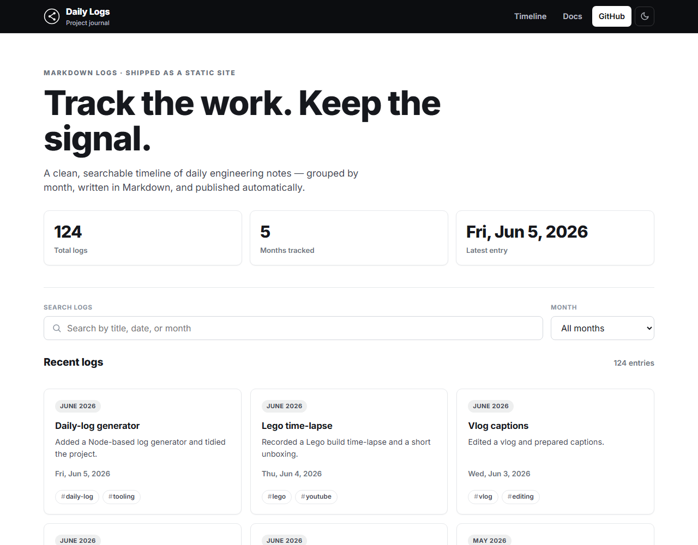
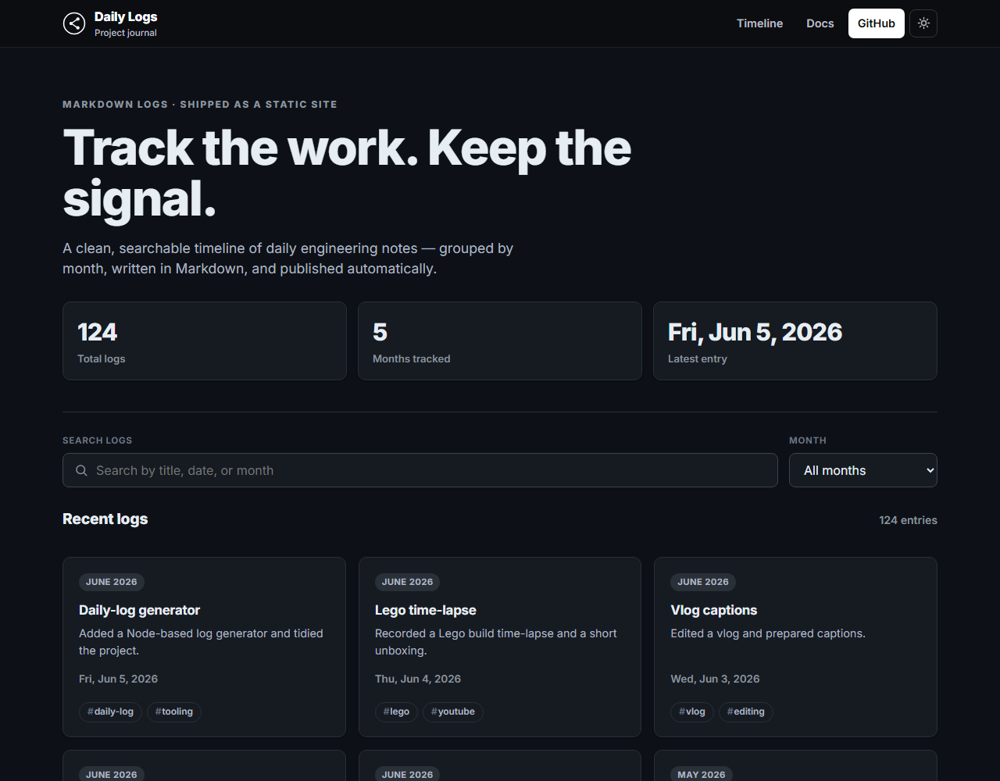

<div align="center">

# 📓 Daily Log

**A simple, automated daily logging system — write Markdown, get a polished static site.**

[](LICENSE)
[](package.json)
[](https://github.com/dawidpolakowski/daily-log/actions/workflows/ci.yml)
[](https://github.com/dawidpolakowski/daily-log/actions/workflows/deploy.yml)
[](CONTRIBUTING.md)

[**Live demo →**](https://dawidpolakowski.github.io/daily-log/)



</div>

---

Daily Log turns a folder of Markdown files into a fast, searchable timeline of
daily notes — grouped by month, tagged, and deployed to GitHub Pages
automatically. No framework, no build pipeline, **zero runtime dependencies**.

## Table of Contents

- [Features](#features)
- [Screenshots](#screenshots)
- [Quick Start](#quick-start)
- [Make It Your Own](#make-it-your-own)
- [Usage](#usage)
- [Project Structure](#project-structure)
- [How It Works](#how-it-works)
- [Log Format](#log-format)
- [Deployment](#deployment)
- [Tech Stack](#tech-stack)
- [Roadmap](#roadmap)
- [Contributing](#contributing)
- [License](#license)

## Features

- 📝 **One-command logs** — `npm run new -- "Title"` scaffolds today's entry.
- 🗂️ **Month folders** — logs live in `logs/2026-04/2026-04-30.md`.
- 🔎 **Search, filter & paginate** entirely client-side.
- 🏷️ **Tags** — add a `## Tags` section and filter by clickable chips.
- 🌗 **Light / dark theme** toggle with persistence and a `?theme=` override.
- ⚡ **Auto-generated index** — `logs.json` (title, excerpt, tags) is rebuilt on
  every push, so it can never drift from the Markdown.
- 🚀 **GitHub Pages deploy** with build-version stamping and verification.
- 🪶 **Zero dependencies** — vanilla JS frontend, Node standard-library tooling.

## Screenshots

| Light | Dark |
| ----- | ---- |
|  |  |

## Quick Start

> Requires **Node.js 18+**. There are no npm dependencies to install.

Want to look around the demo first?

```bash
git clone https://github.com/dawidpolakowski/daily-log.git
cd daily-log
npm run serve                   # preview the demo at http://localhost:3000
```

## Make It Your Own

This repository is published with its author's own logs as a live demo. When you
start your **own** journal you'll want a clean slate — these steps separate your
logs from the demo content so you never commit someone else's entries.

**1. Get your own copy.** Click **[Use this template](https://github.com/dawidpolakowski/daily-log/generate)**
on GitHub (recommended — gives you a fresh history), or fork the repo. Then clone
your copy:

```bash
git clone https://github.com/<you>/<your-repo>.git
cd <your-repo>
```

**2. Clear the demo logs.** One command removes every existing entry, resets the
index, and seeds a single "welcome" log dated today:

```bash
npm run reset            # clears logs/ and seeds a welcome entry
# npm run reset -- --empty   # ...or start with no entries at all
```

> `reset` deletes everything under `logs/`. It asks for confirmation when run
> interactively; pass `--yes` to skip the prompt in scripts.

**3. Write your first real entry and preview it:**

```bash
npm run new -- "My first log"   # create today's entry
npm run serve                   # preview at http://localhost:3000
```

**4. Make it personal.** Update the name, links, and badges in `README.md`,
`package.json`, `CITATION.cff`, and `.github/FUNDING.yml`, then commit and push.

**5. Publish.** In your repo's **Settings → Pages**, set the source to
**Deploy from a branch → `main` → `/ (root)`**. Every push then rebuilds the
index and deploys your timeline automatically. See [Deployment](#deployment).

That's it — your logs now live in your repo, completely independent of this one.

## Usage

| Command                         | What it does                                        |
| ------------------------------- | --------------------------------------------------- |
| `npm run new -- "Title"`        | Create today's log (title optional) and rebuild     |
| `npm run build`                 | Regenerate `logs/logs.json` from the Markdown files |
| `npm run serve`                 | Serve the site locally on port 3000                 |
| `npm run reset`                 | Clear all logs for a fresh start (`-- --empty` / `-- --yes`) |

After editing a log's title, content, or tags, run `npm run build` to refresh
the index. (CI also verifies this on every push.)

## Project Structure

```text
daily-log/
├── index.html          # Timeline page
├── log.html            # Markdown reader
├── script.js           # Loads, filters, and paginates logs.json
├── style.css           # Theme (light/dark, CSS variables)
├── scripts/
│   ├── lib.js          # Core: template, title/excerpt/tag extraction, index builder
│   ├── new.js          # Create today's log + rebuild index
│   ├── build.js        # Rebuild logs.json only
│   ├── reset.js        # Clear demo logs for a fresh start
│   └── serve.js        # Zero-dependency local dev server
├── logs/
│   ├── 2026-04/
│   │   └── 2026-04-30.md
│   └── logs.json       # Generated index — do not edit by hand
└── .github/            # Workflows, issue/PR templates, community files
```

## How It Works

1. **`scripts/new.js`** scaffolds `logs/YYYY-MM/YYYY-MM-DD.md` from a template.
2. **`scripts/lib.js`** scans every month folder and regenerates `logs.json`,
   extracting each file's `# Heading` (title), first body line (excerpt), and
   `## Tags` section.
3. **`script.js`** fetches `logs.json` and renders the searchable timeline;
   `log.html` renders an individual log with [marked](https://marked.js.org).
4. On push, **GitHub Actions** rebuilds the index and deploys to Pages.

## Log Format

```markdown
# Your Title Here

## Date
2026-04-30

## Work done
- Shipped the thing

## Notes
-

## Ideas / Next steps
-

## Tags
- frontend, release
```

The first `# Title` becomes the card title, the first body line becomes the
preview excerpt, and `## Tags` becomes filterable chips.

## Deployment

GitHub Pages, source = `Deploy from a branch` → `main` → `/ (root)`. The
[`deploy.yml`](.github/workflows/deploy.yml) workflow:

1. Regenerates `logs.json` so the published index is always current.
2. Stamps the commit SHA as the build ID.
3. Uploads and deploys the site, then verifies the new build is live.

## Tech Stack

- **Node.js** (zero-dependency generator + dev server)
- **Vanilla JavaScript** frontend
- **GitHub Actions** + **GitHub Pages**

## Roadmap

- [ ] Per-tag archive pages
- [ ] RSS / Atom feed
- [ ] SEO meta per log
- [ ] Optional full-text search index

See [open issues](https://github.com/dawidpolakowski/daily-log/issues) for more.

## Contributing

Contributions are welcome! Please read the [Contributing Guide](CONTRIBUTING.md)
and our [Code of Conduct](CODE_OF_CONDUCT.md). For security issues, see the
[Security Policy](SECURITY.md). A running list of changes lives in the
[Changelog](CHANGELOG.md).

## License

Released under the [MIT License](LICENSE) © 2026 **Dawid Polakowski** ·
[GitHub](https://github.com/dawidpolakowski)
